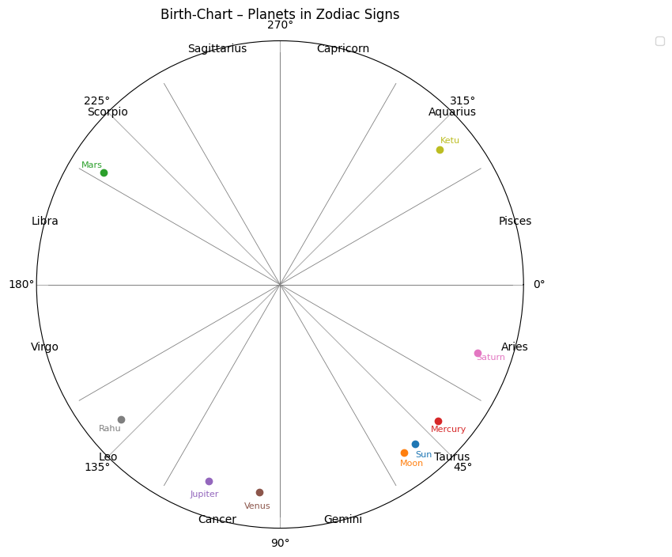

# Vedic Birth-Chart

A simple command-line tool that:

1. Computes your birth-chart (planetary longitudes + Ascendant) using [Swiss Ephemeris](https://www.astro.com/swisseph/).  
2. Formats each planet’s position as **Sign** + **°′** (e.g. `Sun  Sagittarius 13°00′`).  
3. Runs a local `interpret_chart()` routine to give quick Sun–Moon–Mars… readings.  
4. Sends a summary to TinyLlama for **12-month predictions** and **remedial measures**, printing everything to the console.  
5. (Optionally) Plots a polar “zodiac wheel” with your planets marked.

---

## 🔑 Features

- **Interactive CLI**: prompts you for DOB, time, place, and name.
- **Geocoding** via OpenStreetMap/Nominatim.
- **Accurate ephemeris**: uses Swiss Ephemeris for modern planetary positions.
- **Local interpretations**: built-in Vedic quick reads for each planet.
- **TinyLlama integration**: detailed monthly forecasts & remedies.
- **Console-only output**: no files or PDFs—just clean, immediate feedback.
- **Optional chart**: a polar-plot wheel of your birth chart.

---

## ⚙️ Prerequisites

- **Python 3.8+**  
- [Swiss Ephemeris](https://www.astro.com/swisseph/) data files (download and unpack)  
- A running [Ollama](https://ollama.com/) server with the `tinyllama` model installed  

---

### Chart Wheel


---
### Planetary Positions

| Planet  | Sign         | Degrees  |
| ------- | ------------ | -------- |
| Sun     | Aquarius     | 10°17′   |
| Moon    | Aquarius     | 06°23′   |
| Mars    | Leo          | 27°39′   |
| Mercury | Aquarius     | 19°17′   |
| Jupiter | Sagittarius  | 10°07′   |
| Venus   | Sagittarius  | 24°14′   |
| Saturn  | Pisces       | 10°55′   |
| Rahu    | Scorpio      | 10°12′   |
| Ketu    | Taurus       | 10°12′   |

---

### TinyLlama Predictions & Remedies example

**Monthly Prediction:**
1. **Career:** The next 12 months will bring opportunities for new job opportunities and promotions. However, it is advisable to be careful about taking on high-profile roles or risky assignments that may not align with one's values.  
2. **Finance:** Investment opportunities in the stock market are expected to increase over the next 12 months, as well as for property and business ventures. However, it is crucial to stay cautious of financial investments and ensure they align with one's personal goals and values.  
3. **Relationships:** There will be occasional ups and downs in relationships, but overall, the next 12 months will bring stability and support for long-term endeavors. Remedial measures such as setting boundaries and avoiding impulsive decisions are recommended.  
4. **Health:** Ascendant Sun's placement in the first month of the year signals potential stress, anxiety, and irritability. To overcome these challenges, one should prioritize exercise, maintain a healthy diet, and seek professional help if needed.  
5. **Health-related Remedies:** Efforts to boost self-confidence are recommended to reduce the risk of undue aggression or lack of focus in relationships. Additionally, it is essential to maintain a positive attitude and avoid negative self-talk, which can lead to stress.  

**Monthly Remedial Measures:**
1. **Career:** Cautious investment strategies should be followed while entering new business opportunities.  
2. **Finance:** Sticking to financial goals and avoiding impulsive decisions could help maintain stability in finances.  
3. **Relationships:** Prioritizing exercise, healthy diet, and professional guidance can help reduce stress and irritability.  
4. **Health-related Remedies:** Increased effort towards boosting self-confidence may help reduce undue aggression or lack of focus in relationships.  
5. **Remedial Measures:** It's recommended to avoid negative self-talk, maintain a positive attitude, and seek professional help if needed.  
---

## 🔧 Installation

1. **Clone** this repo:  
   ```bash
   git clone https://github.com/<your-username>/vedic-birth-chart-cli.git
   cd vedic-birth-chart-cli
